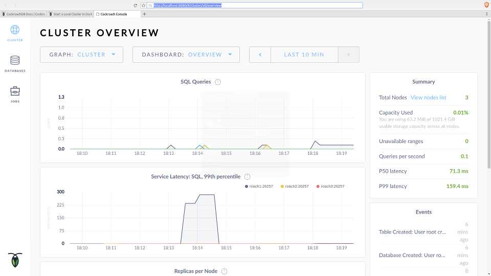

# RESTful Cockroach

An experiment with using [CockroachDB](https://github.com/cockroachdb/cockroach/) as
a drop-in replacement for PostgreSQL.

This builds on my [RESTful-Recipes](https://github.com/mramshaw/RESTful-Recipes) repo,
which stores data in [PostgreSQL](https://www.postgresql.org/). As CockroachDB uses both
the PostgreSQL wire protocol and the Golang driver - while RESTFul-Recipes has acceptance
tests - this is an effort to see how easy it is to use CockroachDB instead of PostgreSQL.

All dependencies are handled via [Docker](https://www.docker.com/products/docker) and __docker-compose__.

TDD (Test-Driven Development) is implemented; the build will fail if the tests do not pass.

Likewise the build will fail if either __golint__ or __go vet__ fails.

Enforces industry-standard __gofmt__ code formatting.

All testing can be done with [curl](CURLs.txt).

## Features

- uses [Gorilla MUX](https://github.com/Gorilla/mux)
- uses [Pure Go postgres driver](https://github.com/lib/pq)

## CockroachDB

According to [Cockroach Labs](https://www.cockroachlabs.com/), cockroach was designed to
be a distributed, fault-tolerant database along the lines of Google's Cloud Spanner.

Certainly replicating databases in the cloud is a non-trivial exercise, so this sounded
like an interesting product to have a look at. As this is purely a compatibility exercise,
there will be no database replication.

## Getting familiar with CockroachDB

The following link will probably be very helpful:

    https://www.cockroachlabs.com/docs/stable/start-a-local-cluster-in-docker.html#os-linux

It seems that the master node is started with `start --insecure` (we are using insecure mode for testing)
while the slave nodes are started with `start --insecure --join=xxxxxx`. And that's it!

The results should look as follows:

    $ docker ps
    CONTAINER ID        IMAGE                          COMMAND                  CREATED             STATUS              PORTS                                              NAMES
    30fe256e9301        cockroachdb/cockroach:v1.1.7   "/cockroach/cockroac…"   2 seconds ago       Up 2 seconds        8080/tcp, 26257/tcp                                roach3
    01d7db6e5f9a        cockroachdb/cockroach:v1.1.7   "/cockroach/cockroac…"   28 seconds ago      Up 28 seconds       8080/tcp, 26257/tcp                                roach2
    5f0e3afea0a8        cockroachdb/cockroach:v1.1.7   "/cockroach/cockroac…"   10 minutes ago      Up 10 minutes       0.0.0.0:8080->8080/tcp, 0.0.0.0:26257->26257/tcp   roach1
    $

Insert into master (the performance stats are a nice touch):

    $ docker exec -it roach1 ./cockroach sql --insecure
    # Welcome to the cockroach SQL interface.
    # All statements must be terminated by a semicolon.
    # To exit: CTRL + D.
    #
    # Server version: CockroachDB CCL v1.1.7 (linux amd64, built 2018/03/26 15:56:41, go1.8.3) (same version as client)
    # Cluster ID: d9d00482-ea21-4cc1-b0e5-481e2cca8022
    #
    # Enter \? for a brief introduction.
    #
    root@:26257/> CREATE DATABASE bank;
    CREATE DATABASE
    
    Time: 291.557247ms
    
    root@:26257/> CREATE TABLE bank.accounts (id INT PRIMARY KEY, balance DECIMAL);
    CREATE TABLE
    
    Time: 254.09533ms
    
    root@:26257/> INSERT INTO bank.accounts VALUES (1, 1000.50);
    INSERT 1
    
    Time: 270.104136ms
    
    root@:26257/> SELECT * FROM bank.accounts;
    +----+---------+
    | id | balance |
    +----+---------+
    |  1 | 1000.50 |
    +----+---------+
    (1 row)
    
    Time: 1.295917ms
    
    root@:26257/> \q
    $

Query a replica:

    $ docker exec -it roach2 ./cockroach sql --insecure
    # Welcome to the cockroach SQL interface.
    # All statements must be terminated by a semicolon.
    # To exit: CTRL + D.
    #
    # Server version: CockroachDB CCL v1.1.7 (linux amd64, built 2018/03/26 15:56:41, go1.8.3) (same version as client)
    # Cluster ID: d9d00482-ea21-4cc1-b0e5-481e2cca8022
    #
    # Enter \? for a brief introduction.
    #
    root@:26257/> SELECT * FROM bank.accounts;
    +----+---------+
    | id | balance |
    +----+---------+
    |  1 | 1000.50 |
    +----+---------+
    (1 row)
    
    Time: 128.987392ms
    
    root@:26257/> \q
    $

Cockroach comes with a sweet UI (which uses port 8080):

## To Run

The command to run:

    $ docker-compose up -d

For the first run, there will be a warning as `mramshaw4docs/golang-alpine-cockroach:1.8` must be built.

This image will contain all of the Go dependencies and should only need to be built once.

For the very first run, `golang` may fail as it takes `cockroach` some time to ramp up.

A successful `golang` startup should show the following as the last line of `docker-compose logs golang`:

    golang_1    | 2018/02/24 18:38:01 Now serving recipes ...

In this line does not appear, repeat the `docker-compose up -d` command (there is no penalty for this).

## To Build:

The command to run:

    $ docker-compose up -d

Once `make` indicates that `restful_cockroach` has been built, can change `docker-compose.yml` as follows:

1) Comment `command: make`

2) Uncomment `command: ./restful_cockroach`

## For testing:

[Optional] Start cockroach:

    $ docker-compose up -d cockroach

Start golang [if cockroach is not running, this step will start it]:

    $ docker-compose run --publish 80:8100 golang make

Successful startup will be indicated as follows:

    2018/02/24 16:27:10 Now serving recipes ...

This should make the web service available at:

    http://localhost/v1/recipes

Once the service is running, it is possible to `curl` it. Check `CURLs.txt` for examples.

## See what's running:

The command to run:

    $ docker ps

## View the build and/or execution logs

The command to run:

    $ docker-compose logs golang

## To Shutdown:

The command to run:

    $ docker-compose down

## Clean Up

The command to run:

    $ docker-compose run golang make clean

## Results

At least with the current release (v1.1.7) of CockroachDB, the features I use are not all there:

    $ docker-compose up golang
    restfulcockroach_cockroach_1 is up-to-date
    Starting restfulcockroach_golang_1 ... 
    Starting restfulcockroach_golang_1 ... done
    Attaching to restfulcockroach_golang_1
    golang_1     | GOPATH=/go GOOS=linux GOARCH=amd64 gofmt -d -e -s -w *.go
    golang_1     | GOPATH=/go GOOS=linux GOARCH=amd64 gofmt -d -e -s -w application/*.go
    golang_1     | GOPATH=/go GOOS=linux GOARCH=amd64 gofmt -d -e -s -w recipes/*.go
    golang_1     | GOPATH=/go GOOS=linux GOARCH=amd64 gofmt -d -e -s -w test/*.go
    golang_1     | GOPATH=/go GOOS=linux GOARCH=amd64 golint -set_exit_status *.go
    golang_1     | GOPATH=/go GOOS=linux GOARCH=amd64 golint -set_exit_status ./...
    golang_1     | GOPATH=/go GOOS=linux GOARCH=amd64 go tool vet *.go
    golang_1     | GOPATH=/go GOOS=linux GOARCH=amd64 go tool vet application/*.go
    golang_1     | GOPATH=/go GOOS=linux GOARCH=amd64 go tool vet recipes/*.go
    golang_1     | GOPATH=/go GOOS=linux GOARCH=amd64 go tool vet test/*.go
    golang_1     | GOPATH=/go GOOS=linux GOARCH=amd64 go test -v test
    golang_1     | 2018/04/03 20:38:00 pq: unimplemented at or near "cascade"
    golang_1     | exit status 1
    golang_1     | FAIL	test	0.010s
    golang_1     | make: *** [Makefile:33: test] Error 1
    restfulcockroach_golang_1 exited with code 2
    $

I thought my SQL was pretty vanilla, but it seems cascading deletes are not available.

Even so, it does seem that "ON DELETE CASCADE" is on the radar for the future.

## To Do

- [ ] Upgrade to latest Go
- [ ] Fix database initialization script (currently must run manually)
- [ ] Try again with the next point release of CockroachDB
- [ ] Investigate the feature roadmap of CockroachDB

## Credits

This exercise was inspired by the following episode of __Go Time__:

    https://changelog.com/gotime/73
